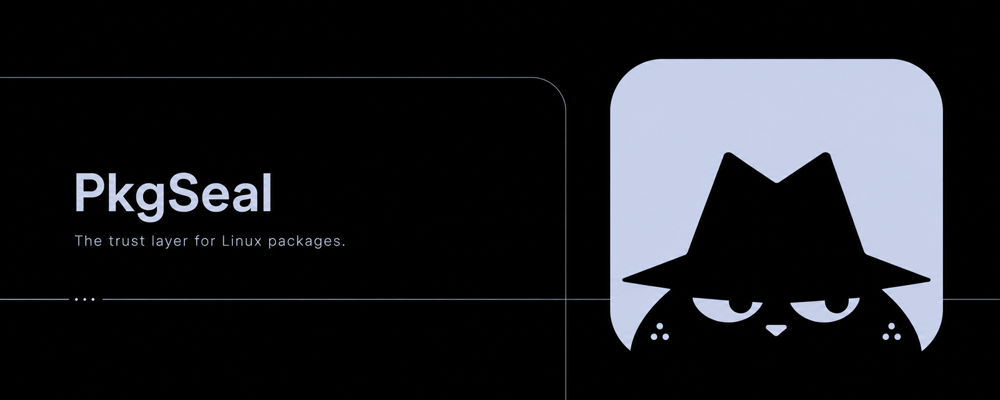
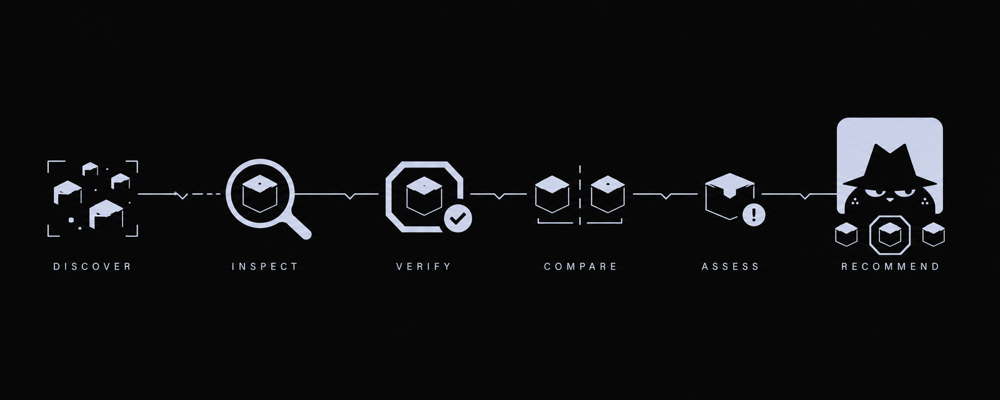
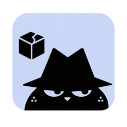
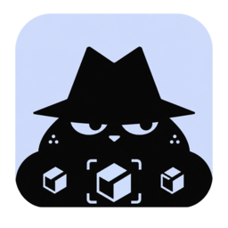
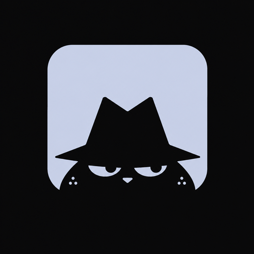

<div align="center">
  
</div>

<br />

<div align="center">

[](https://github.com/MikeRoss27/pkgseal/actions/workflows/ci.yml)
[](#license)
[](#project-status)

</div>

PkgSeal is a desktop application for discovering, comparing, evaluating, and eventually installing Linux software from multiple package sources.

Instead of asking users to choose blindly between an official repository package, an AUR package, a Flatpak, a vendor package, or another distribution format, PkgSeal collects the available options, inspects their provenance and trade-offs, and recommends the most appropriate source according to an explicit policy.

PkgSeal starts with **Arch Linux**, but its core architecture is intentionally designed to support other Linux distributions later.


## Overview

Installing an application on Linux is often less obvious than it should be. Searching for a single application can produce several legitimate installation paths:

```text
Brave Browser
├── Arch repository
├── AUR
├── Flatpak
├── vendor package
└── other third-party distribution
```

Those options are not equivalent. They can differ in publisher provenance, package maintainer, sandboxing, permissions, update mechanism, native integration, package signatures, build scripts, dependency model, upstream support, and security trade-offs.

Most package managers are excellent at managing **their own source**. PkgSeal focuses on the layer above them: evaluating the choice *before* installation, and making that choice explainable.

> **PkgSeal must never hide a trust decision behind an Install button.**

PkgSeal does not claim that a package is "100% safe". Recommendations are based on explicit evidence:

```text
✓ package from an official repository
✓ publisher-supported installation method
✓ verified publisher
✓ package signature
✓ checksum present
✓ sandboxed application

⚠ community-maintained package
⚠ broad filesystem permissions
⚠ build logic changed since previous release
⚠ unverified publisher
```

No opaque `97/100` security score. The user should always be able to understand **why** PkgSeal recommends one candidate over another.


## How PkgSeal works

<div align="center">
  
</div>

| Step | What happens |
| --- | --- |
| **Discover** | Find available package/source candidates for the requested application. |
| **Inspect** | Inspect relevant package and source metadata. |
| **Verify** | Evaluate integrity and trust evidence, such as signatures and checksums. |
| **Compare** | Compare the available candidates against each other. |
| **Assess** | Identify suspicious or higher-risk characteristics. |
| **Recommend** | Present the preferred option with supporting evidence. |

<details>
<summary>Example: how a recommendation is explained</summary>

```text
Brave Browser

Recommended
brave-bin · AUR

Why PkgSeal recommends this

✓ Publisher-supported installation path
✓ Native Chromium sandbox behavior
✓ Checksum available
⚠ Community-maintained AUR recipe

Alternatives
├── Flatpak
└── other available candidates

[Review evidence]                     [Install]
```

For an AUR update:

```text
PKGBUILD changed

Version
1.2.0 → 1.3.0

Source URL
changed

Checksum
changed

Build logic
unchanged
```

</details>

<!-- Screenshot / product preview: add apps/desktop screenshots to
     .github/assets/brand/screenshots/ and reference them here once available. -->


## Features

<table>
<tr>
<td width="60" align="center"></td>
<td><strong>Inspect sources</strong><br />Collect and inspect metadata across Arch repositories, AUR, and Flatpak candidates for the same application.</td>
</tr>
<tr>
<td align="center"></td>
<td><strong>Verify integrity</strong><br />Evaluate integrity evidence such as package signatures and checksums.</td>
</tr>
<tr>
<td align="center"></td>
<td><strong>Compare options</strong><br />Compare equivalent packages side by side instead of picking one blindly.</td>
</tr>
<tr>
<td align="center"></td>
<td><strong>Check provenance</strong><br />Distinguish official repositories from community-maintained content, and surface publisher verification and maintainer information.</td>
</tr>
<tr>
<td align="center"></td>
<td><strong>Assess risk</strong><br />Statically inspect AUR <code>PKGBUILD</code>s for risk patterns and surface Flatpak sandbox permissions — without ever executing untrusted build scripts.</td>
</tr>
<tr>
<td align="center"></td>
<td><strong>Recommend</strong><br />Produce a policy-driven recommendation backed by explicit, readable evidence.</td>
</tr>
</table>


## Initial package sources

The first supported ecosystem is Arch Linux. PkgSeal initially targets:

- **Arch official repositories**
- **AUR**
- **Flatpak / Flathub**

The architecture is designed so future adapters can be added without rewriting the core decision engine:

```text
sources/
├── arch
├── aur
├── flatpak
├── debian       # future
├── fedora       # future
├── nix          # future
├── snap         # future
└── appimage     # future
```

## Product policies

Recommendations are policy-driven rather than hard-coded around a universal source ranking.

Initial policy ideas include:

**Balanced** — balances provenance, upstream support, security, sandboxing, native integration, and maintainability.

**Native First** — prefers native packages when their trust and maintenance characteristics are comparable.

**Sandbox First** — prefers sandboxed desktop applications when their permissions remain reasonable.

**Maximum Review** — requires stronger review before accepting community-maintained or broadly privileged packages.

A rule such as `Arch > Flatpak > AUR` is intentionally **not** treated as universally correct — the right choice can depend on the specific application.


## Installation

PkgSeal is in early foundation stage — there is no packaged release yet, and it does not modify your system. To run it from source:

**Prerequisites**

- [Rust](https://www.rust-lang.org/) (stable toolchain, see `rust-toolchain.toml`)
- [Bun](https://bun.sh/) `1.4.0`
- Tauri system dependencies on Linux: `libwebkit2gtk-4.1-dev`, `libgtk-3-dev`, `libayatana-appindicator3-dev`, `librsvg2-dev`, `patchelf`

**Run the desktop app in development**

```bash
cd apps/desktop
bun install
bun run tauri dev
```

**Build a release bundle**

```bash
cd apps/desktop
bun run build:app
```

**Rust workspace**

```bash
cargo build --all
cargo test --all
```


## Security / trust model

Security issues should not be reported publicly before a responsible disclosure process is followed — see [`SECURITY.md`](SECURITY.md).

PkgSeal itself follows the same principle it asks of package sources: provenance, review, explicit trust boundaries, and explainable decisions.

- AUR `PKGBUILD` is treated as **untrusted data** — PkgSeal never sources or executes it to analyze a package. Static inspection may highlight patterns such as `curl | sh`, `wget | sh`, `eval`, unexpected privilege escalation, setuid changes, or downloaded code executed during build. A finding is not automatic proof of malicious behavior — PkgSeal reports facts and context rather than alarmist conclusions.
- For Flatpak, PkgSeal surfaces publisher verification, application ID, remote, filesystem permissions, network access, and other sandbox characteristics. A verified publisher means stronger provenance evidence — it does not mean the application is guaranteed free of vulnerabilities.
- The frontend (React/WebView) is unprivileged and may only invoke typed Tauri commands — never a generic `run_as_root(command)`.
- Policy evaluation is deterministic (`Evidence → Policy → Recommendation`) — no opaque scores.

Full threat model: [`docs/adr/001-core-architecture.md`](docs/adr/001-core-architecture.md). Reporting process: [`SECURITY.md`](SECURITY.md).


## Architecture

PkgSeal is organized by product responsibility rather than by language:

```text
pkgseal/
│
├── apps/
│   └── desktop/         # Tauri 2 + React desktop application
│
├── engine/
│   ├── domain/          # portable product logic and decisions
│   ├── resolver/        # groups candidates into one application identity
│   ├── policy/          # deterministic, explainable recommendations
│   └── transactions/    # typed install/remove plans
│
├── sources/
│   ├── arch/
│   ├── aur/
│   └── flatpak/
│
├── platform/
│   └── linux/           # privileged system integration
│
├── testkit/             # reusable test infrastructure
├── fixtures/            # deterministic source data for tests
└── docs/                # architecture decisions
```

Design boundaries: `engine/domain` performs no network or system IO, `engine/policy` is deterministic and performs no IO, source adapters never define product policy, transaction plans are inspectable before execution, and privilege boundaries are explicit — the frontend is never given a generic `run_command_as_root(...)`.

The desktop client is built with Tauri 2, React, TypeScript, Vite, Tailwind CSS, shadcn/ui, Base UI, TanStack Query, and Rust. Privileged actions route through a typed IPC boundary and Polkit authorization rather than an unrestricted shell:

```text
React UI → typed IPC → Tauri boundary → PkgSeal engine → source adapters / Linux platform → typed transaction → privileged helper + Polkit
```

Full details:

- [Architecture Overview](docs/architecture/overview.md)
- [Core Architecture ADR](docs/adr/001-core-architecture.md)


## Development strategy

PkgSeal is intentionally built **read-only first**.

| Phase | Focus |
| --- | --- |
| 0 | Foundation — Tauri shell, React/Vite, Rust workspace, design system, CI, test infrastructure |
| 1 | Package explorer — read-only search across Arch, AUR, Flatpak |
| 2 | Resolver — group package candidates belonging to the same application |
| 3 | Evidence — provenance, verification, permissions, AUR metadata, PKGBUILD findings |
| 4 | Policy engine — deterministic, explainable recommendations |
| 5 | Transaction preview — generate install/remove plans without executing them |
| 6 | Arch transactions — controlled native package operations |
| 7 | Flatpak transactions |
| 8 | AUR transactions — only after the review and privilege model is mature |
| 9 | Product polish — keyboard-first UX, command palette, accessibility, HiDPI, performance |

The first meaningful version of PkgSeal will **not install anything**. It should reliably perform: search → discover candidates → resolve identity → inspect evidence → compare sources → recommend one → explain why, for a reference corpus (Brave, Bitwarden, Discord, Spotify, Visual Studio Code, Steam, Obsidian). If PkgSeal cannot reliably explain those decisions, it is not ready to modify the system.

### Road to `v0.1-alpha`

`v0.1-alpha` is complete when PkgSeal launches cleanly on Arch Linux, the desktop design system is stable, Arch/AUR/Flatpak search works, equivalent package candidates are grouped correctly, provenance and security evidence are visible, the policy engine produces explainable recommendations, critical tests work without network access, CI is green, no arbitrary shell execution is exposed, and **no system mutation is possible yet**.

## Testing philosophy

Package management is too sensitive for "works on my machine". PkgSeal uses Rust unit tests, policy decision matrices, deterministic fixtures, frontend component tests, IPC boundary tests, and integration tests. Network responses used by core tests are captured as fixtures, and real installation tests never run against a developer's workstation — only disposable environments.

Every merge requires frontend lint/typecheck/test/build, Rust `fmt`/`clippy`/`test`/`build`, and security checks (dependency audit, secret scanning, forbidden-pattern checks) — see [`.github/workflows/ci.yml`](.github/workflows/ci.yml).

## Project status

**Current status: early architecture / foundation.**

PkgSeal is currently defining its architecture, trust model, UI foundations, and first read-only vertical slice. The project is **not ready for production use** and should not yet be trusted to modify a real system.


## Contributing

PkgSeal is currently in its foundation stage. Contribution guidelines will be introduced once repository conventions are stable, CI is running, the first source adapter contracts are finalized, and coding/testing standards are enforced automatically.

Until then, architecture changes should be documented through ADRs in [`docs/adr/`](docs/adr/).

## Documentation

```text
docs/
├── adr/
│   └── 001-core-architecture.md
├── architecture/
│   └── overview.md
├── security/
└── product/
```

Start here: [Core Architecture ADR](docs/adr/001-core-architecture.md) · [Architecture Overview](docs/architecture/overview.md)

## License

Licensed under either of

- Apache License, Version 2.0 ([LICENSE-APACHE](LICENSE-APACHE))
- MIT license ([LICENSE-MIT](LICENSE-MIT))

at your option. SPDX: `MIT OR Apache-2.0`. Security policy: [SECURITY.md](SECURITY.md).

<br />

<p align="center">
  
  <br />
  <strong>PkgSeal</strong> — the trust layer for Linux packages.
</p>
